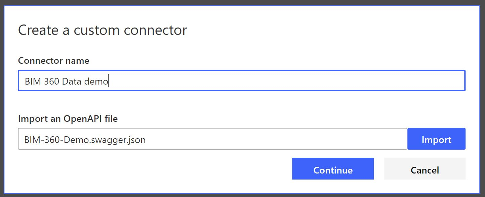

# power-automate-bim360-issues-to-sql

A Power Automate Flow and Custom Connector to push BIM 360 issues from a selected BIM 360 project to a SQL table

 

## Description

This is a custom connector and a flow package for [Microsoft Power Automate](https://flow.microsoft.com/) that allow to use [Autodesk Forge APIs](https://forge.autodesk.com/developer/documentation) to push Issues' data from a [Autodesk BIM 360 Field Management](https://field.b360.autodesk.com/login) project to a SQL Database table. 

## Setup
#### 1. Create Autodesk Forge App.
* Visit the [Forge Portal](https://forge.autodesk.com) and sign up for an account
* [Create an App](https://developer.autodesk.com/myapps/create). Callback URL is not being used by this script. When asked for the 'callback URL', you can use any URL
* Take note of the **Client ID** and **Client Secret**.

#### 2. Add Custom Integration to BIM 360 Account
* Login to your BIM 360 Account Admin site, https://admin.b360.autodesk.com/
* Go to “SETTINGS” tab then to “Custom Integrations” tab
* Click on “Add Custom Integration” button to register your app for this specific account
* Verify that you have access to a [BIM360 Field Management](https://field.b360.autodesk.com/login) project under this BIM 360 Account

#### 3. Create SQL Database Table
(**For this demo, SQL Server is hosted on Azure portal. You may choose other ways to host the SQL Server**)
* Create Azure SQL Server, a blank database, and set SQL server firewall to enable access from Azure Services and other Client IPs. Check the following tutorial [https://docs.microsoft.com/en-us/azure/azure-sql/database/single-database-manage](https://docs.microsoft.com/en-us/azure/azure-sql/database/single-database-manage)
* Download [dbo.bim360_issues.Table.sql](dbo.bim360_issues.Table.sql) SQL script file
* Create SQL table **BIM360_issues** by executing [SQL Script file](dbo.bim360_issues.Table.sql) on the SQL Database. Check the following article [Execute a Script in SQL Server](https://onlinehelp.coveo.com/en/ces/7.0/administrator/running_a_script_in_microsoft_sql_server.htm)

#### 4. Import Custom Connector
* Download [BIM-360-Demo.swagger.json](BIM-360-Demo.swagger.json) 
* Login to Power Automate site, https://flow.microsoft.com/
* In the navigation panel on the left, select **Data > Custom connectors**
* Select **New custom connector**, then choose **Import an OpenAPI file**
* Enter a name for the custom connector (like "BIM 360 Data demo"), then navigate to the **JSON** file that was downloaded, and choose **Continue**

* **(Optional)** Download [BIM-360-icon.jpg](BIM-360-icon.jpg), click **Upload connector icon**, and choose **BIM-360-icon.jpg**
* Select **Security** tab, input **Client ID** and **Client Secret** from step 1, input **https://developer.api.autodesk.com/authentication/v1/refeshtoken** for **Refresh URL**, then click **Create connector**
* When completed, copy the value from **Redirect URL**
* Go to [Forge Portal](https://forge.autodesk.com), edit Forge App from step 1, and update the **Callback URL** with the custom connector **Redirect URL**

#### 5. Add "BIM 360 Data demo" and "SQL Server" Connections to Power Automate
* Login to Power Automate site, https://flow.microsoft.com/
* In the navigation panel on the left, select **Data > Connections**
* At the top of the page, select **New connection**
* In the list of available connections, find **BIM 360 Data demo** connection
* Follow the steps to enter your credentials to configure the connection
* Select **New connection** again
* In the list of available connections, find **SQL Server** connection
* Follow the steps to enter your credentials to configure the connection with the database 

#### 6. Import Flow ".zip Package"
* Download [PushBIM360IssuestoSQL.zip](PushBIM360IssuestoSQL.zip)
* In Power Automate, select **My flows** from the navigation panel on the left, then click on **Import**
* In the Import Package page, click on the **Upload** button and select the **.zip package** downloaded earlier, then click on **Import**
* Scroll down to **Related resource**, click on each **Select during import** and select the appropriate connection, and click on **Import**
* When Import is completed, select **My flows**, look for **Push BIM 360 Issues to SQL** flow, and click on it. It should look like this: [bim360-issues-to-sql.pdf](bim360-issues-to-sql.pdf)

## License

This sample is licensed under the terms of the [MIT License](http://opensource.org/licenses/MIT).
Please see the [LICENSE](LICENSE) file for full details.

## Written by

Sam Nseir, P.E. [@samnseirpe](https://www.linkedin.com/in/samnseirpe/) 
